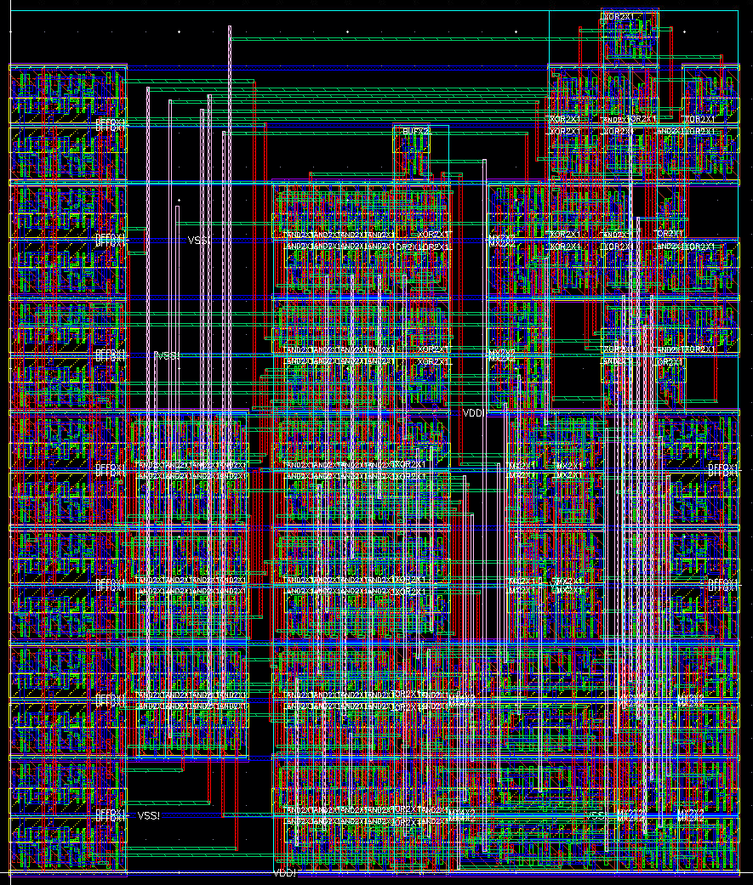

# 4-bit ALU Design

## Overview

This project involves the design and implementation of a simplified 4-bit Arithmetic Logic Unit (ALU) using Cadence Virtuoso and the gpdk045/gsclib045 technology. The project is divided into 2 stages, with each stage documented through a detailed report.

## Project Structure

### Reports

- **Planning Stage Report**: This report outlines the initial planning and design considerations for the ALU.
- **Implementation Stage Report**: This report details the implementation phase of the project, including schematics, measurements and floor plans.

### Content of the Planning Stage
   - Project I/O
   - Opcode Assignment
   - Block Design and Methodology
   - Cell Number and Area Estimation
   - Floor Plan

### Content of the Implementation Stage

1. **Schematics**:
   - ALU schematic
   - Block schematics in Virtuoso
   - Testbench

2. **Measurements**:
   - Logic tests (proof of good calculations)
   - Delay measurements (including QRC measurements)
   - Maximal clock frequency

3. **Floor Plan**:
   - Final floor plan and size comparison
   - Block layouts
   - Full ALU layout
   - DRC, LVS, and QRC extraction

## Repository Structure

